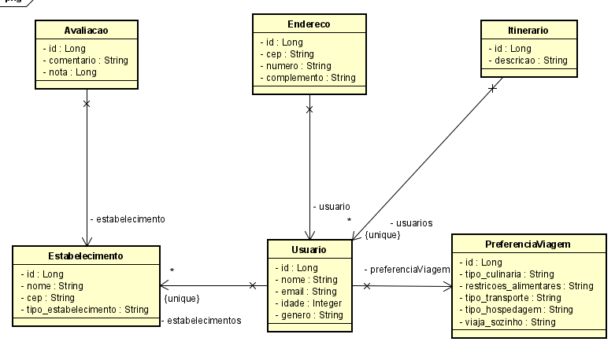

# TechPeach: Planejamento de Viagens Personalizadas com IA


**TechPeach** é uma plataforma inovadora que utiliza inteligência artificial e análise de dados para criar itinerários de viagem personalizados adaptados às preferências individuais dos usuários. Nossa missão é proporcionar uma experiência de viagem mais gratificante e autêntica, conectando viajantes a destinos e atividades que realmente os inspirem.

## Integrantes

* **Allesson Augusto (RM99533):** Compliance & Quality Assurance
* **Cauã Mongs (RM552178):** Advanced Business Development with .NET
* **Erik Teixeira (RM551377):** Disruptive Architectures: IOT, IOB & Generative IA e Java Advanced
* **Guilherme Naoki (RM551456):** Mastering Relational and Non-Relational Database
* **Leonardo Gonçalves (RM98912):** DevOps Tools e Cloud Computing

**Contribuições em Equipe:**
* Mobile App Development: Todo o grupo colaborou.


## Rodando a Aplicação

**Pré-requisitos:**

* Java JDK 8 ou superior
* Maven
* Banco de dados (ex: MySQL, PostgreSQL)

**Passos:**

1. **Clone o Repositório:**
   ```bash
   git clone https://github.com/ErikTeixeira/java_challenge_.git

2. **Configure o Banco de Dados:**
    * Crie um banco de dados e atualize as configurações de conexão no arquivo application.properties.

3. **Construa a Aplicação:**
    ```bash
    mvn clean package

4. **Execute a Aplicaçãos:**
    ```bash
   java -jar target/TechPeach.jar

5. **Execute a Aplicaçãos:**
    * A aplicação estará disponível em http://localhost/


Para rodar os comandos acima no Windows, você pode usar o Prompt de Comando ou o PowerShell:

1. Abra o Prompt de Comando ou PowerShell.
2. Navegue até o diretório onde você clonou o repositório.
3. Execute os comandos conforme indicado nos passos acima.

Certifique-se de que o Maven e o Java estão corretamente instalados e configurados no seu PATH do Windows.


## Diagramas

**Diagrama da Sprint 2:**
    

**Diagrama da Sprint 1:**
    


## Vídeo da Proposta Tecnológica

**Link da Sprint 2:**
    * https://youtu.be/JiGy_ohObWo

**Link da Sprint 1:**
    * https://youtu.be/0c4opnXL8fU


## Documentação da API (Endpoints)

### Usuários

- **POST /usuarios:** Criar um novo usuário.
- **GET /usuarios:** Buscar usuários (com filtros opcionais).
- **GET /usuarios/{id}:** Buscar usuário por ID.
- **POST /usuarios/{id}/estabelecimentos:** Adicionar um estabelecimento a um usuário.
- **GET /usuarios/{id}/estabelecimentos:** Listar estabelecimentos de um usuário.

### Avaliações

- **POST /avaliacao:** Criar uma nova avaliação.
- **GET /avaliacao:** Buscar avaliações (com filtros opcionais).
- **GET /avaliacao/{id}:** Buscar avaliação por ID.

### Endereços

- **POST /endereco:** Criar um novo endereço.
- **GET /endereco:** Buscar endereços (com filtros opcionais).
- **GET /endereco/{id}:** Buscar endereço por ID.

### Itinerários

- **POST /itinerario:** Criar um novo itinerário.
- **GET /itinerario:** Buscar itinerários (com filtros opcionais).
- **GET /itinerario/{id}:** Buscar itinerário por ID.


## Descrição do Problema e Solução

### Problema
Planejar viagens pode ser um processo tedioso e desafiador, especialmente para encontrar atividades e locais que se alinhem com as preferências individuais dos viajantes.

### Solução
TechPeach utiliza inteligência artificial e análise de dados para compreender as preferências dos usuários, gerando itinerários personalizados que atendem às suas necessidades.

### Público-Alvo
Viajantes e turistas que buscam uma experiência de viagem personalizada e memorável.

### Benefícios
- **Experiências Autênticas:** Conecta viajantes a atividades e locais que realmente os inspirem.
- **Planejamento Simplificado:** Facilita o processo de planejamento de viagens.
- **Personalização:** Cria itinerários sob medida adaptados às preferências dos usuários.
- **Ofertas Exclusivas:** Oferece ofertas especiais em parceria com estabelecimentos locais.

### Diferenciais
- **IA Avançada:** Utiliza algoritmos de IA sofisticados para gerar recomendações precisas.
- **Parcerias Locais:** Colabora com estabelecimentos locais para oferecer experiências autênticas e ofertas especiais.


Com o TechPeach, os viajantes podem descobrir e reservar atividades personalizadas, tornando suas viagens mais memoráveis e autênticas!
