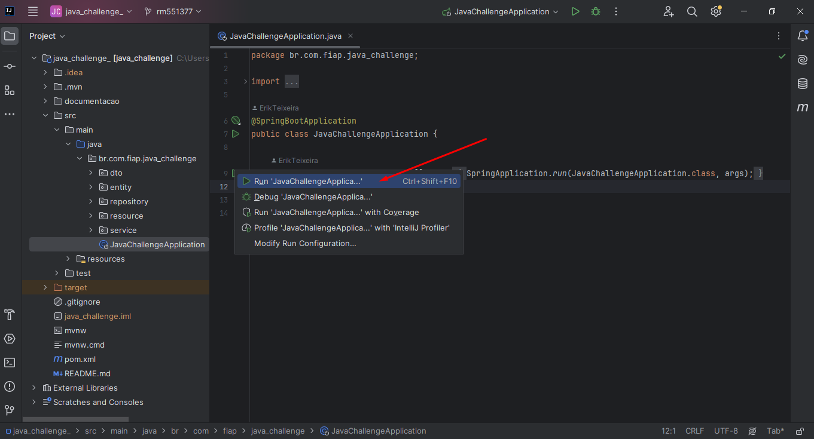
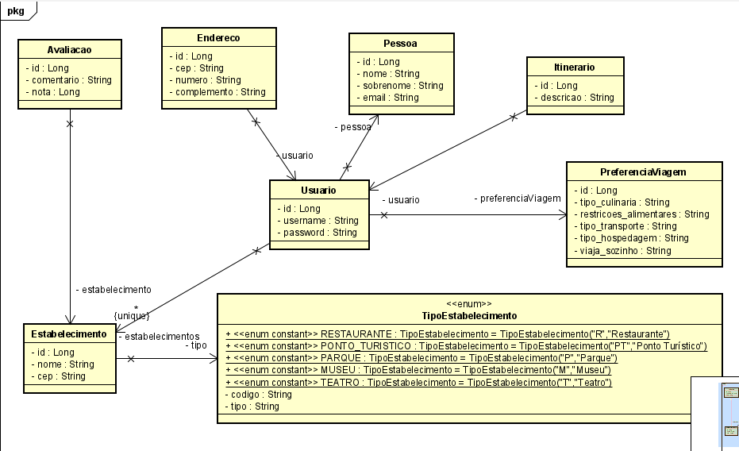
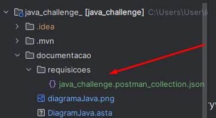

# TechPeach
2TDSPJ - Challenge - 2024

## Integrantes
 . Allesson Augusto - rm99533  -  COMPLIANCE & QUALITY ASSURANCE  
 . Cauã Mongs - rm552178 - ADVANCED BUSINESS DEVELOPMENT WITH .NET
  
 . Erik Teixeira - rm551377  -  DISRUPTIVE ARCHITECTURES: IOT, IOB &
GENERATIVE IA  
 . Guilherme Naoki - rm551456  -  MASTERING RELATIONAL AND NON-RELATIONAL DATABASE  
 . Leonardo Gonçalves - rm98912  -  DEVOPS TOOLS E CLOUD COMPUTING
  

JAVA ADVANCED  - O grupo inteiro ajudou  
MOBILE APP DEVELOPMENT  - O grupo inteiro ajudou

## Como rodar o projeto

## Diagrama

## Link do vídeo

##  Listagem de todos os endpoints 

